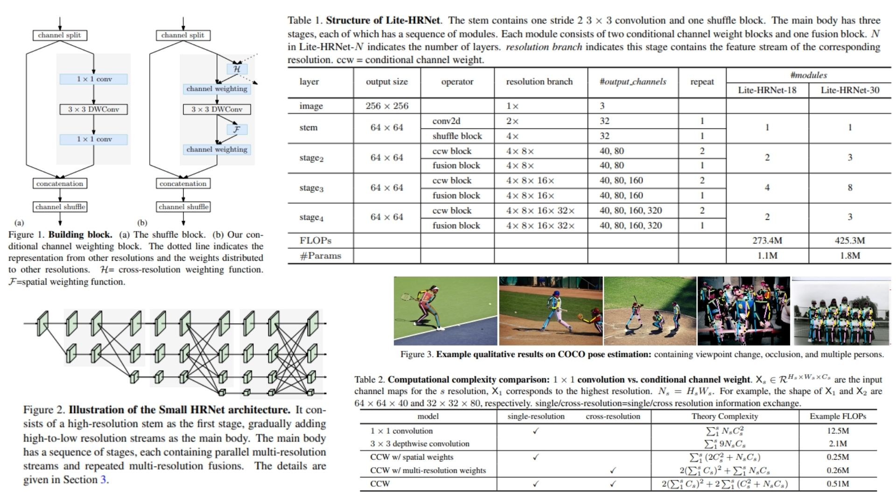

# 🧿 LiteHRNet-Replication — Efficient High-Resolution Network for Human Pose Estimation

This repository provides a **faithful Python replication** of the **Lite-HRNet architecture**, designed for efficient **human pose estimation under limited computational budgets**. It reconstructs the full pipeline described in the original paper, including a **high-resolution backbone (HRNet-style), conditional channel weighting (CCW), cross-resolution feature interaction, and lightweight fusion modules**.

Paper reference: *Lite-HRNet: A Lightweight High-Resolution Network*  https://arxiv.org/abs/2104.06403  

---

## Overview 🪷



> The architecture preserves **high-resolution representations throughout all stages** while replacing expensive channel mixing operations (especially $$1 \\times 1$$ convolutions) with a lightweight **Conditional Channel Weighting (CCW)** mechanism that enables efficient cross-channel and cross-resolution interaction.

Key ideas:

- **High-Resolution Backbone (HRNet-style)** maintains parallel multi-scale feature streams throughout the network  
- **Conditional Channel Weighting (CCW)** replaces costly $$1 \\times 1$$ convolutions with adaptive feature reweighting  
- **Cross-Resolution Interaction** aggregates information across all resolution branches using lightweight pooling-based generation  
- **Spatial + Channel Dependency Modeling** without heavy convolutional cost  
- **Progressive Multi-Stage Design** (Stage 2 → Stage 4) refines representations at multiple scales  

---

## Core Math 📐

**Conditional Channel Weighting (core operation):**

$$
Y_s = W_s \\odot X_s
$$

**Cross-resolution weight generation:**

$$
(W_1, W_2, ..., W_s) = H_s(X_1, X_2, ..., X_s)
$$

**Cross-resolution aggregation (simplified):**

$$
X' = \\text{Concat}(\\text{AAP}(X_1), ..., \\text{AAP}(X_{s-1}), X_s)
$$

**Weight computation pipeline:**

$$
W = \\sigma (W_2(\\text{ReLU}(W_1(X))))
$$

**Spatial weighting branch:**

$$
w_s = F_s(X_s)
$$

**Final feature modulation:**

$$
Y_s = (W_s \\odot w_s) \\odot X_s
$$

---

## Why Lite-HRNet Matters 🧬

- Replaces expensive $$\\mathcal{O}(C^2)$$ channel mixing with lightweight $$\\mathcal{O}(C)$$ weighting  
- Preserves **high-resolution spatial information across all stages**  
- Enables strong performance on **human pose estimation tasks under low FLOPs budgets**  
- Maintains accuracy while significantly reducing computational cost  

---

## Repository Structure 🏗️

```bash
LiteHRNet-Replication/
├── src/
│   ├── blocks/
│   │   ├── stem.py
│   │   ├── ccw_block.py
│   │   ├── fusion_block.py
│   │   └── conv_bn.py
│   │
│   ├── modules/
│   │   ├── hrnet_stage.py
│   │   └── weight_generator.py
│   │
│   ├── model/
│   │   └── lite_hrnet.py
│   │
│   └── config.py
│
├── images/
│   └── figmix.jpg
│
├── requirements.txt
└── README.md
```

---

## 🔗 Feedback

For questions or feedback, contact:  
[barkin.adiguzel@gmail.com](mailto:barkin.adiguzel@gmail.com)
